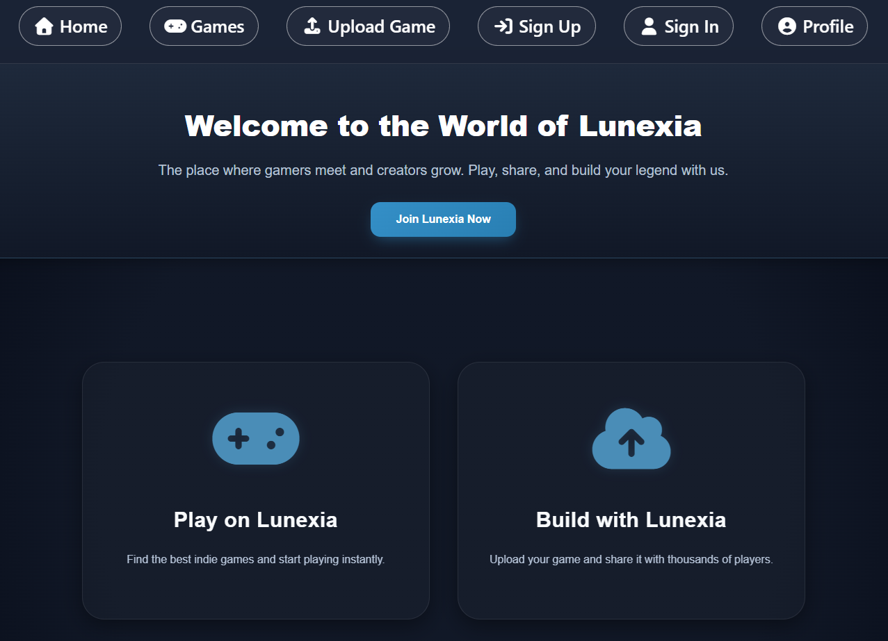
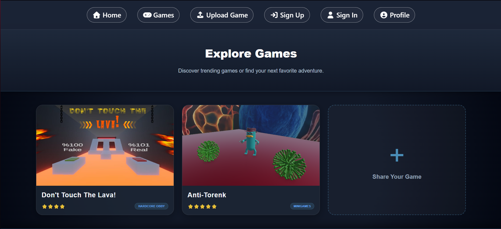
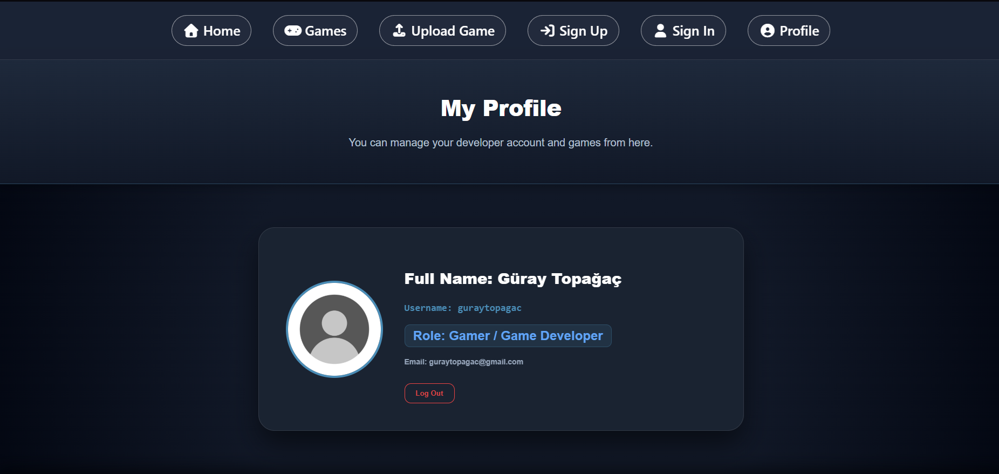

# 🎓 SENG 204 Final Project

<p align="center">
  
  <kbd>✨ You can view it live by clicking on the image.</kbd>
</p>
---

## 🔗 Quick Access

| 🌐 Live website | 📂 Source Codes |
| :--- | :--- |
| [project-lunexia.onrender.com](https://project-lunexia.onrender.com) | [GitHub Repository](https://github.com/Lunexia-Team/lunexia) |

---

## ⚡ About the Project

**Lunexia** is a modern **indie game distribution platform** designed to bridge the gap between independent developers and gamers. Developed as a final project for SENG 204, this platform allows users to discover new titles and manage their favorite indie games through a seamless interface. 

> 🎮 **Beyond the Platform:** To demonstrate the platform's capabilities, we also developed **two original games** included in the library, showcasing a complete end-to-end integration of game development and distribution.

---

## ✨ Key Features

*   **Original Game Content:** Includes two custom-developed indie games to provide a ready-to-play experience.
*   **User Authentication:** Secure login and registration system.
*   **Game Discovery:** Browse and search for various indie games.
*   **Responsive Design:** Fully compatible with both desktop and mobile devices.
*   **Database Integration:** Dynamic content management using MongoDB.

## 📸 Screenshots

### Home Page


### Game Library


### Upload Page


## 🛠 Technologies Used

| Category | Technologies |
| :--- | :--- |
| **Backend** |   |
| **Frontend** |     |
| **Database** |  |
| **Package Management** |  |
| **Distribution** |  |

---

## 🧠 System Architecture

The system follows a client-server architecture:

- **Frontend:** Vue.js (Single Page Application)
- **Backend:** Node.js + Express (REST API)
- **Database:** MongoDB
- **Communication:** HTTP (RESTful APIs)


## 🗂 Project Structure

```bash
lunexia/
├── assets/                # Media files and screenshots used in documentation
├── client/                # Frontend source code built with Vue.js
├── server/                # Backend API and database logic built with Node.js & Express
├── .env.example           # Template for environment variables (Port, MongoDB URI, etc.)
├── .gitignore             # Files and directories to be ignored by Git
├── LICENSE                # Project license information
├── README.md              # Project documentation and setup guide
├── package-lock.json      # Locked versions of project dependencies
└── package.json           # Project metadata, scripts, and dependency list
```
---

## 🚀 Installation and Setup

1. Clone the repository:
   
   ```bash
   git clone https://github.com/Lunexia-Team/lunexia.git
   
2. Enter the project directory:
   
   ```bash
   cd lunexia

3. Install the necessary dependencies:
   
   ```bash
   npm install

4. Start the server:
   
   ```bash
   npm start

5. View the project in your browser:
   
   ```bash
   http://localhost:3000

## 🗄 Database Configuration

MongoDB is used in this project.

Before running the project:

1. Create a `.env` file in the project root directory.
2. Define this file by referencing the `.env.example` file.
3. Ensure that the MongoDB service is running.

Note: The `.env` file has not been added to the repository for security reasons.

## 👥 Contributors

- [Güray Topağaç](https://github.com/guraytopagac)
- [Mehmet Emin Yıldırım](https://github.com/MehmetEmin61)
